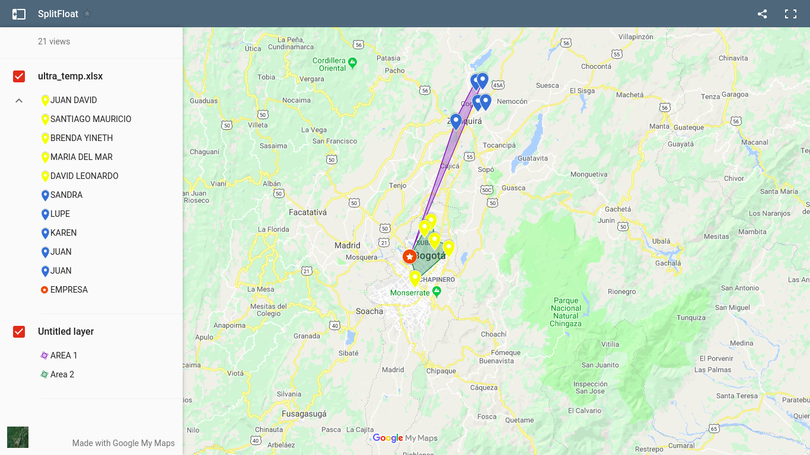

# SplitFlow 



En este repositorio se encuentra el proyecto y prototipo presentado.

- Backend: Incluye el servidor desarrollado en Python Flask realizado que consiste en una API REST.
- Front: Incluye toda la capa visual desarrollada en el proyecto.
- Data: Incluye las definiciones de las bases de datos realizadas y el codigo de transformacion de los datos.
- Analytics: Incluye todo el codigo de Ciencia de Datos desarrollado en Python para el analisis y determinacion de ruta optima. 

## Backend

Para arrancar el servidor coloque el siguiente codigo:

```
cd ./Backend
export FLASK_APP=hello.py
flask run
```

La API tiene los siguientes endpoints:

- (POST) /upload: Envia tabla de empleados y retorna el analsis realizado. 
- (GET) /: Envia por defecto los archivos estaticos de la Single Page Application de Front.
- (GET) /analytics: Retorna el estado de analisis actual de la compañia.

## FrontEnd

El front end de la aplicacion consisten en una Single Page Application hecha en ReactJS que
utiliza las APIs de Google Mas para dibujar el map de congregaciones, distancias y tiempos
optimos para empleados.

## Data

Incluimos las tablas de datos en formato Excel utilizados para la presentacion y visual y los
analisis realizados.

## Analytics

La seccion de Analisis de Datos fue montando sobre python utilizando numpy y pandas. Los analisis
fueron realizados utilizando metodos de estadistica bayesiana para determinar los mejores tiempos
de transito de los empleados de la empresa empleando los tiempos estimas de llegada (ETA) dados
por Google Maps API.